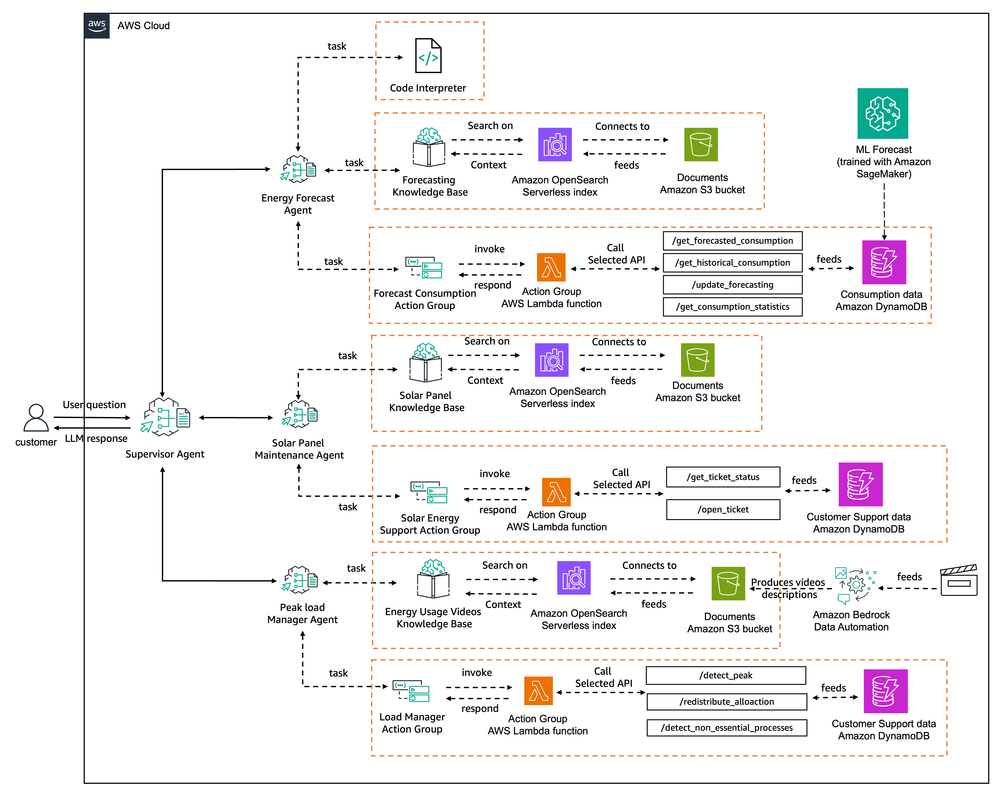

# Retail Operations Management System - Multi-Agent Workshop

## Overview

This public AWS workshop showcases the new Amazon Bedrock Agents feature - [multi-agent collaboration capabilities](https://docs.aws.amazon.com/bedrock/latest/userguide/agents-multi-agent-collaboration.html) - through a Retail Operations Management System.
The system consists of a supervisor agent that orchestrates three specialized sub-agents, each handling specific aspects of retail management and customer service.
The complete workshop can be accessed on [AWS Workshop Studio](https://catalog.us-east-1.prod.workshops.aws/workshops/1031afa5-be84-4a6a-9886-4e19ce67b9c2/en-US).

## System Architecture

```
├── 1- Sales Forecasting Agent
├── 2- Inventory Management Agent
├── 3- Store Operations Manager Agent
├── 4- Retail Operations Management Agent (Supervisor)
└── 5- Clean up
```

## Agents Description

### Retail Operations Management Agent (Supervisor)

The supervisor agent coordinates the activities of three specialized sub-agents,
routing customer queries and requests to the appropriate agent while maintaining context and
ensuring seamless interactions. The architecture looks as following:



### Sub-Agents

#### 1. Sales Forecasting Agent

- Provides current sales data
- Provides sales forecasts
- Provides customer purchasing statistics
- Contains code interpretation capabilities to analyze forecasting data

#### 2. Inventory Management Agent

- Provides inventory stocking guidelines and requirements
- Offers inventory maintenance instructions
- Enables support ticket creation
- Tracks existing support tickets

#### 3. Store Operations Manager Agent

- Identifies inefficient store processes
- Analyzes peak vs. off-peak store traffic
- Optimizes staffing allocation

## Workshop Contents

1. Sales forecasting agent setup
2. Inventory management agent setup
3. Store operations manager agent
4. Multi-agent collaboration setup
5. Supervisor agent invocation
6. Clean up

## Prerequisites

- AWS Account with appropriate permissions
- Amazon Bedrock access
- Basic understanding of AWS services
- Python 3.8+
- Latest Boto3 SDK
- AWS CLI configured

## Getting Started

1. Clone this repository:

```bash
git clone https://github.com/aws-samples/bedrock-multi-agents-collaboration-workshop.git
```

2. Install dependencies:

```bash
pip install -r requirements.txt
```

3. Follow the setup instructions in the workshop guide, linked in the Overview section.

## Security

See [CONTRIBUTING](CONTRIBUTING.md#security-issue-notifications) for more information.

## License

This project is licensed under the MIT-0 License - see the LICENSE file for details.

## Support

For support and questions, please open an issue in the repository.

---

Note: This workshop is for educational purposes and demonstrates the capabilities of Amazon Bedrock Agents' multi-agent collaboration feature.
